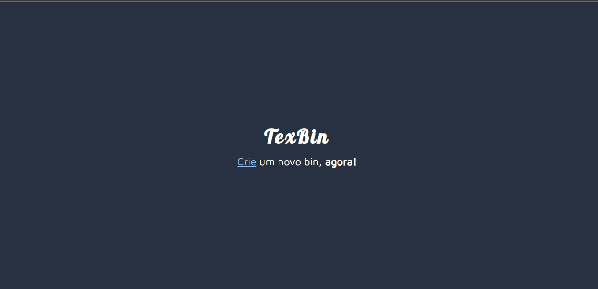
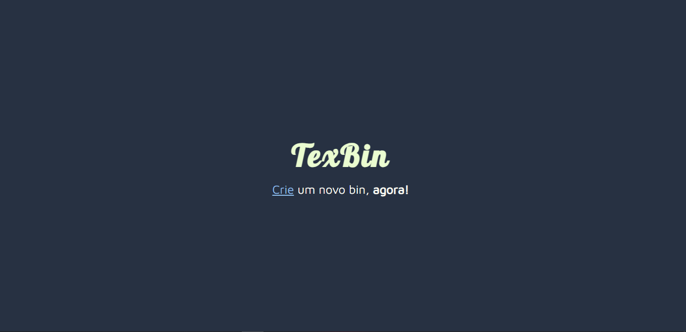
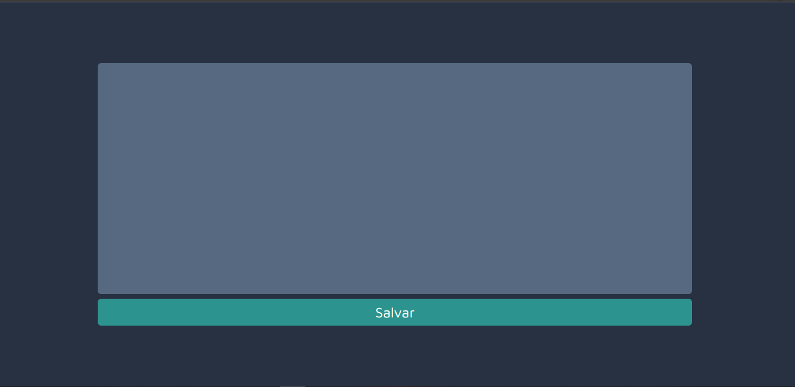
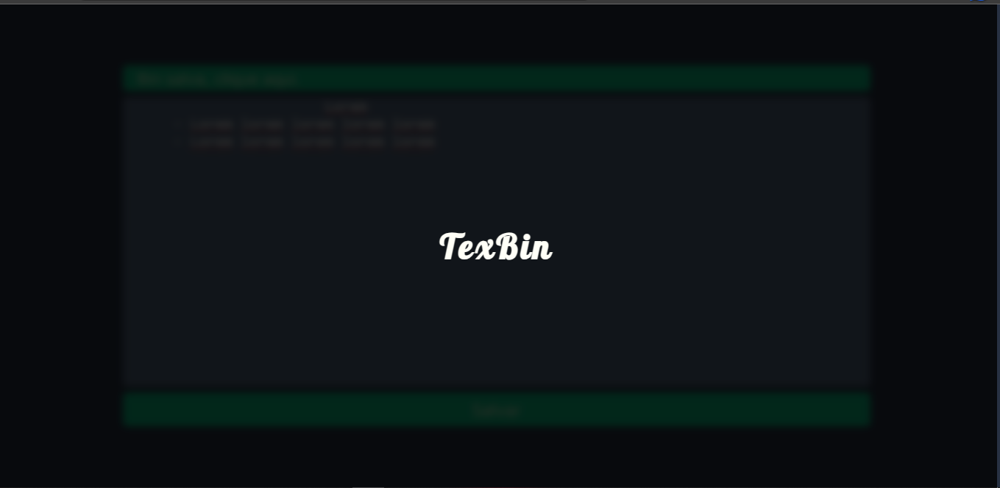
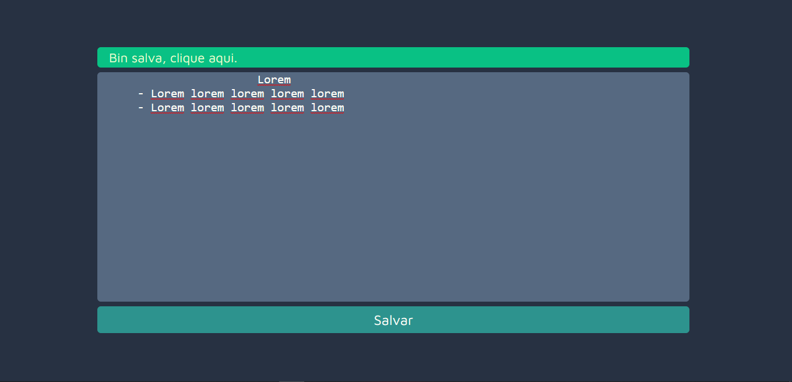
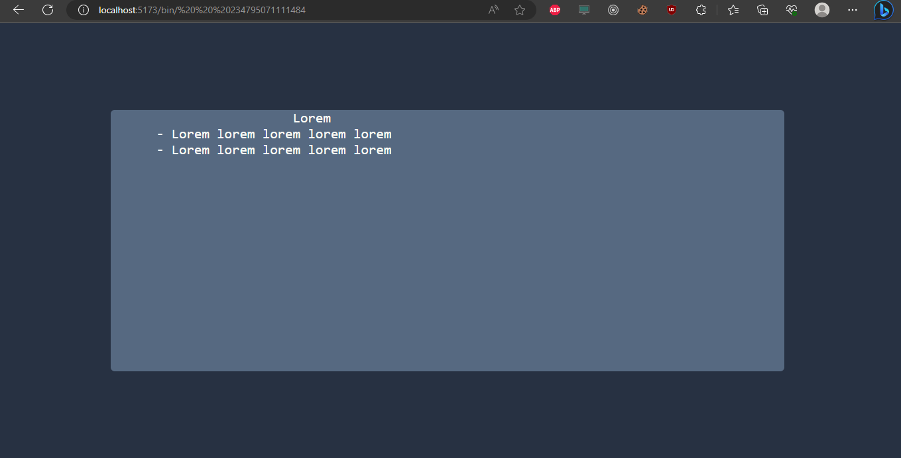

# TexBin

## Requirements:
 - NodeJS.
 - MySql.

## How do i install all dependencies?

Go to folder of back and frontend, and run the command to install all dependencies:

````
 npm install
```

And now, to run:

```
 npm run dev
```


## Screenshots

<div style="display: flex; flex-direction: row; flex-wrap: wrap; justify-content: center; align-items: center;">
 

 

 

 

 

 
</div>
